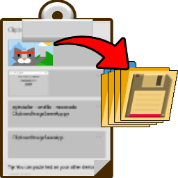
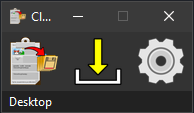
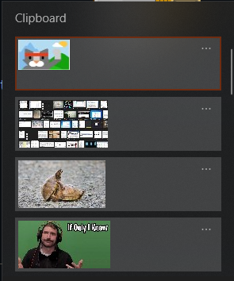
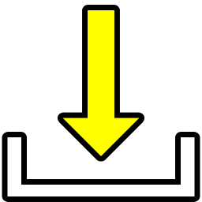
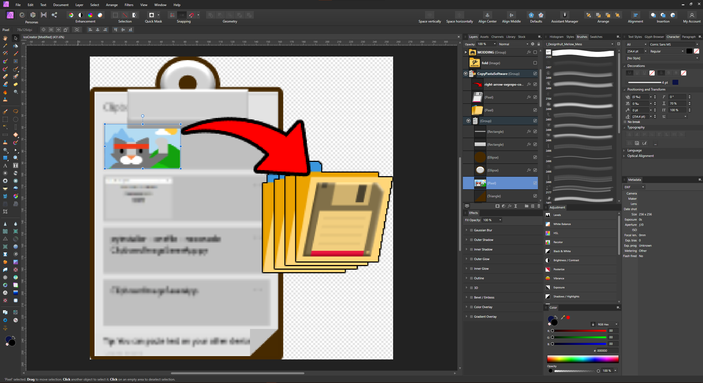
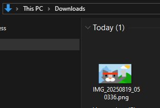

# Clipboard Image Saver

<p align="center">
  
</p>

A compact Windows utility built with Python and Tkinter to instantly save images from your clipboard.

<p align="center">
  
</p>

## Features

-   **One-Click Insta-Save:** Instantly save the clipboard image to a predefined folder.
-   **Save As... Dialog:** Standard save dialog for choosing a specific name and location.
-   **Persistent Settings:** Remembers your preferences and window position in a `ClipboardSaver.ini` file.
-   **Icon-Based UI:** Clean, compact interface with intuitive icons.
-   **Settings Menu:**
    -   "Always on Top" toggle.
    -   Set custom default folders for both "Save As" and "Insta-Save".

## Use Cases

The real power of this app is speed. It turns multi-step file saving into a single click.

### 1. Quick Windows Snip to File

This is the classic workflow. It turns saving a screenshot into a simple two-click action.

1.  **Snip:** Use the Windows Snipping Tool (`Win` + `Shift` + `S`) to capture any part of your screen.
    <p align="center">
      
    </p>

2.  **Save:** Click the  **Insta-Save** button on the app.

3.  **Done:** The image is instantly saved with a timestamped filename in your chosen 'Insta-Save' folder.

### 2. Exporting Layers from Design Software

A common task in graphic design is exporting a single element as its own file. This app makes it instant.

1.  **Copy Layer:** In your design software (like Affinity Photo or Photoshop), select the layer you want to export. It can even be resized or positioned partially off-canvas. Copy it to the clipboard (`Ctrl` + `C`).
    <p align="center">
      
    </p>

2.  **Insta-Save:** Click the **Insta-Save** button in Clipboard Image Saver.

3.  **TADAA!! ✨** The layer is immediately saved as a new, perfectly cropped PNG file.
    <p align="center">
      
    </p>

> **Important Note:** The saved image will have the exact resolution as it appears on your canvas. If you copy a 100x100 pixel layer, you get a 100x100 pixel PNG. This is perfect for exporting assets for web or app development.

Here's the layer saved with a single click:

<p align="center">
  
</p>

## Getting Started

### Prerequisites
- Python 3.x
- `pillow` and `pyinstaller` libraries. You can install them using pip:
  ```bash
  pip install -r requirements.txt